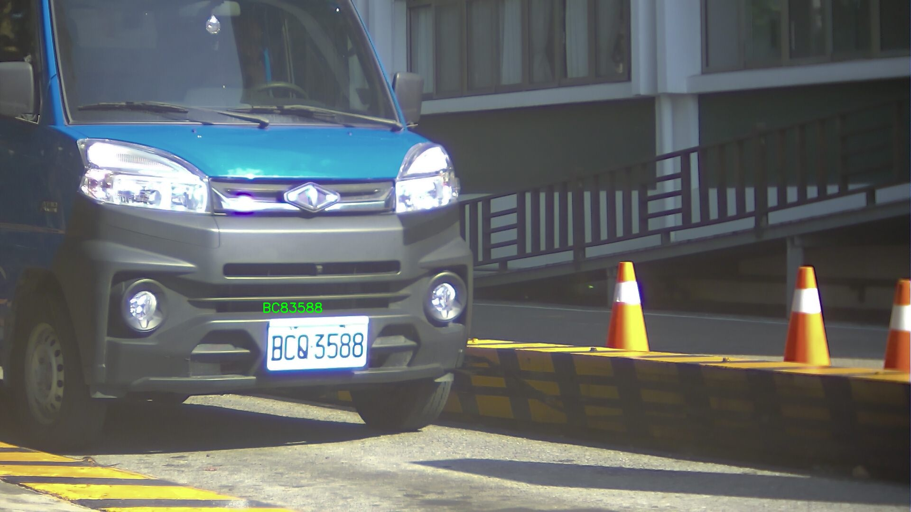
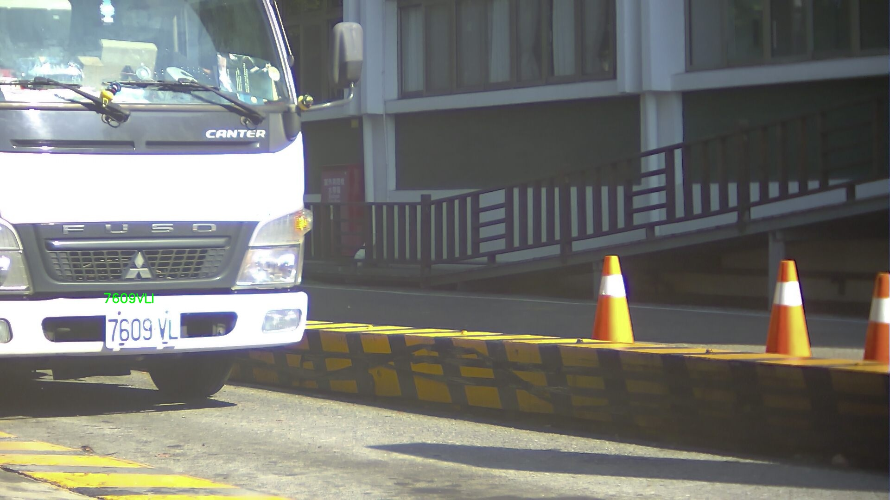
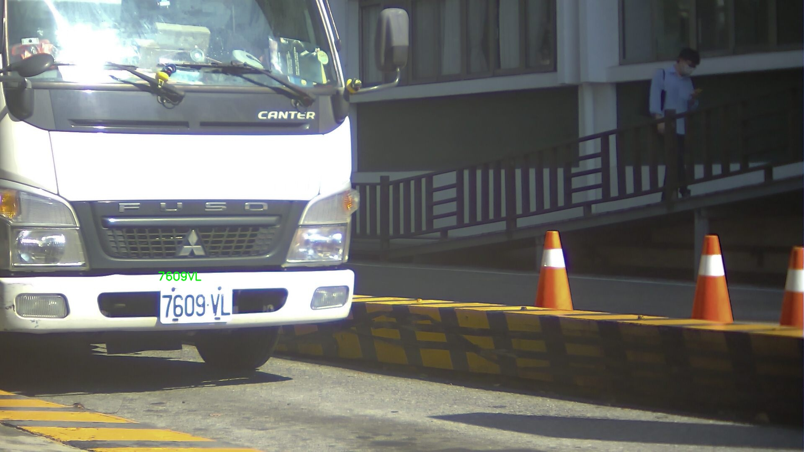
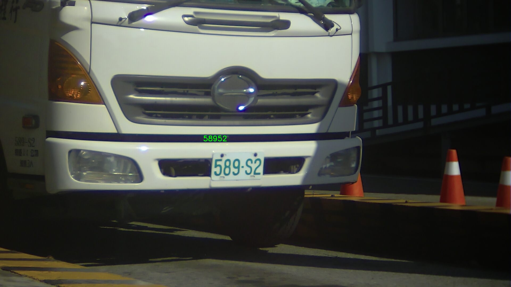
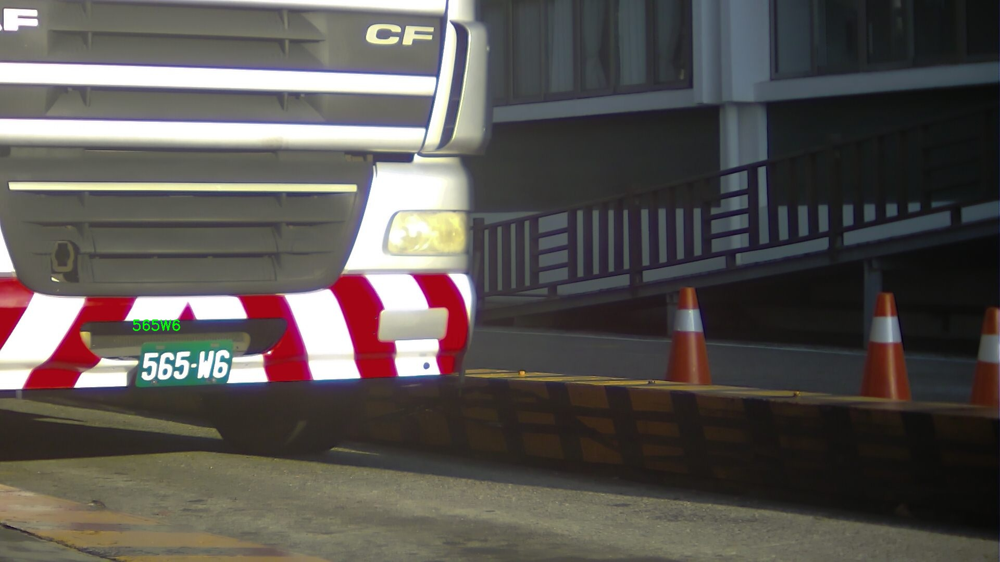

# License Plate Recognition Project of the Weigh Stations

## Introduction

This project is searching for a suitable algorithm and record the fine-tuning process.

## Table of Contents

* [Surveyed Algorithms](#surveyed-algorithms)
* [Annotation](#annotation)
* [PaddleOCR Fine Tuning Process](#paddleocr-fine-tuning-process)
    * [1. Install PaddlePaddle](#1-install-paddlepaddle)
    * [2. Prepare files for training](#2-prepare-files-for-training)
        * [2.1 Prepare yml file](#21-prepare-yml-file)
        * [2.2 Download Pretrained models](#22-download-pretrained-models)
        * [2.3 Move annotated data](#23-move-annotated-data)
    * [3. Fine tuning precess](#3-fine-tuning-precess)  
        * [3.1 Train or Fine Tune](#31-train-or-fine-tune)
        * [3.2 Export model](#32-export-model)
        * [3.3 Fine tuned model usage](#33-fine-tuned-model-usage)
        * [3.4 Inference examples](#34-inference-examples)
* [Source](#source)

## Surveyed Algorithms

- [PaddleOCR](https://github.com/PaddlePaddle/PaddleOCR)(Recently studying)

- [EasyOCR](https://github.com/JaidedAI/EasyOCR)(Pending)

- [Tesseract OCR](https://github.com/tesseract-ocr/tesseract)(Pending)

## Annotation

<div align="center">
    
</div>

[PPOCRLabelv2](https://github.com/PFCCLab/PPOCRLabel?tab=readme-ov-file)

You can use this tool to annotate the images which contain text on it. Follow [PPOCRLabelv2 Usage](https://github.com/PFCCLab/PPOCRLabel?tab=readme-ov-file#2-usage) instructions then you can get annotated data.

⚠️Description : Dataset root path
  ```
    |-train_data
        |- word_001_crop_0.png
        |- word_002_crop_0.jpg
        |- word_003_crop_0.jpg
        | ...
    | train_list.txt
    | val_list.txt
  ```

## PaddleOCR Fine Tuning Process

### 1. Install PaddlePaddle

Install [PaddlePaddle](https://www.paddlepaddle.org.cn/en) by the official site. 
⚠️Please confirm the corresponding PaddlePaddle version, OS version, installation method and CUDA version. Install according to the above version.
⚠️If you only have cpu on your PC:
```bash
pip3 install --upgrade pip

# If you only have cpu on your machine, please run the following command to install
python3 -m pip install paddlepaddle
```
For more software version requirements, please refer to the instructions in [Installation Document](https://www.paddlepaddle.org.cn/install/quick) for operation.

### 2. Prepare files for training

#### 2.1 Prepare yml file

There is a [example](configs/rec/PP-OCRv4/FENC_CarLicensePlateOCR.yml) i built.

#### 2.2 Download Pretrained models

You can find and download some Pretrained models in this [website](https://paddlepaddle.github.io/PaddleOCR/latest/ppocr/model_list.html). After that, you need to unzip the .tar file and move to the [folder](pretrained_models/)

#### 2.3 Move annotated data

You need to move your annotated data to the [folder](data/). Annotated data includes train_data(folder with crops images), train_list.txt and val_list.txt.


### 3. Fine tuning precess

#### 3.1 Train or Fine Tune

Follow the command then you might start training.
```bash
python tools/train.py -c configs/rec/PP-OCRv4/FENC_CarLicensePlateOCR.yml
```

#### 3.2 Export model

After training, the weights we saved which we can not use directly. Follow this command to export models.
```bash
python tools/export_model.py -c configs/rec/PP-OCRv4/FENC_CarLicensePlateOCR.yml -o Global.pretrained_model=./output/FENC_CarLicensePlateOCR/latest.pdparams  Global.save_inference_dir=./inference/rec_model/
```

#### 3.3 Fine tuned model usage

Follow the python commands, you can import PaddlePaddle and load model weights sucessfully.
```bash
rom paddleocr import PaddleOCR
ocr = PaddleOCR(
    lang='en',
    rec_model_dir="inference/rec_model/",
    # use_gpu=True         # Set to True to use GPU
) # need to run only once to load model into memory
```
#### 3.4 Inference examples

|                  Pretrained model                   |                Fine-tuned model                |
| :-------------------------------------------------: | :--------------------------------------------: |
|     |  |
|  |    |
|     |  |
|  |    |


## Source

- [PPOCRLabelv2](https://github.com/PFCCLab/PPOCRLabel?tab=readme-ov-file)
- [PaddleOCR](https://github.com/PaddlePaddle/PaddleOCR)
- [EasyOCR](https://github.com/JaidedAI/EasyOCR)
- [Tesseract OCR](https://github.com/tesseract-ocr/tesseract)

